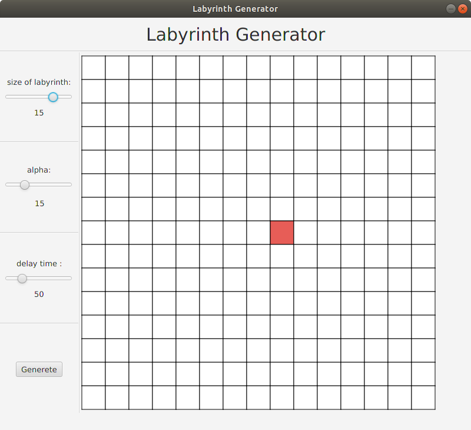
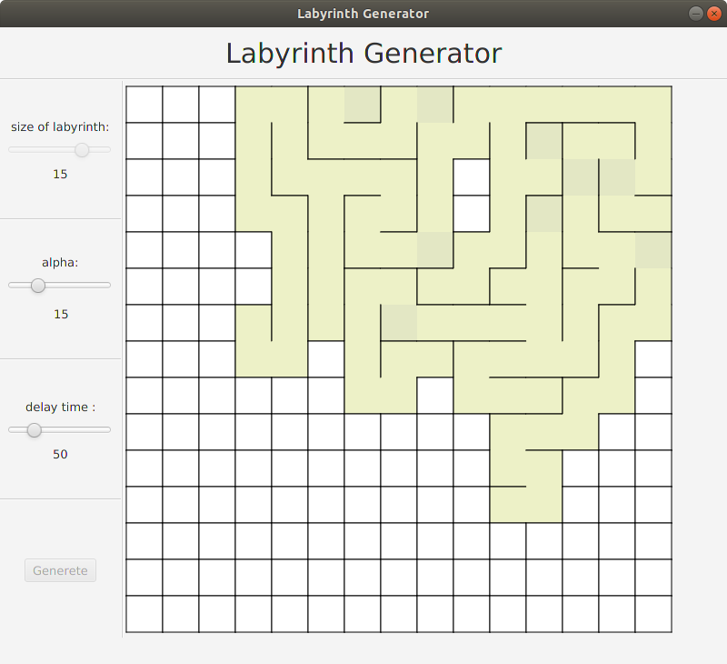
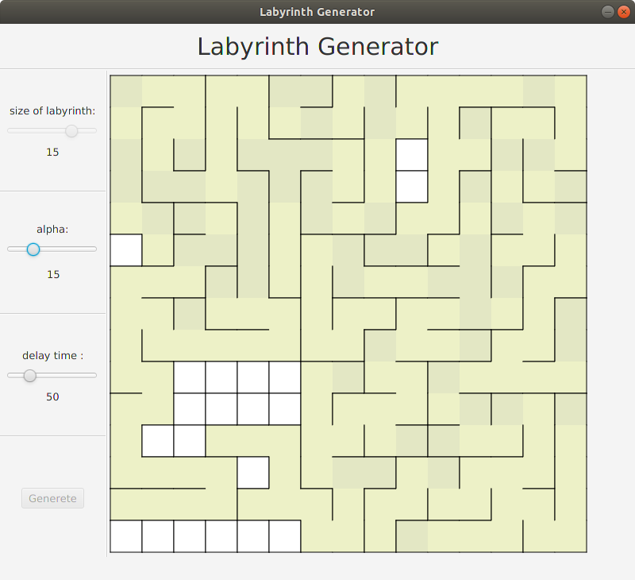
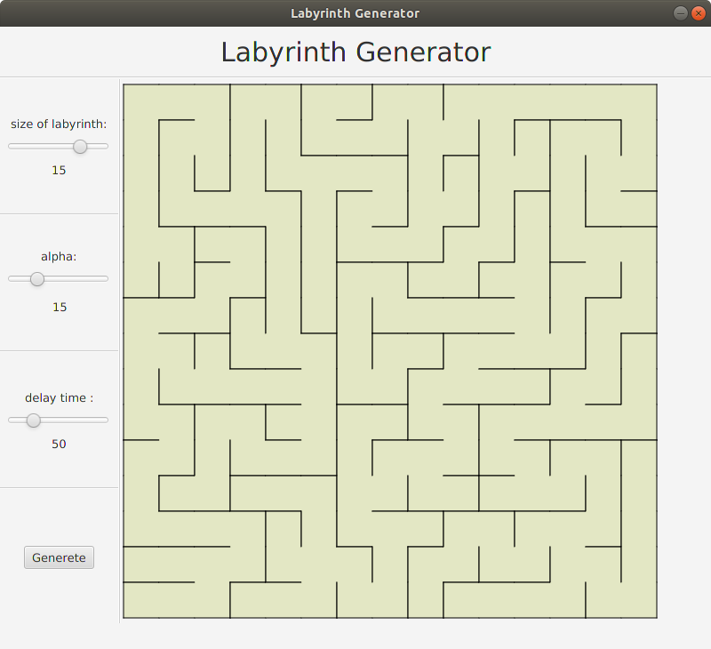

# Labyrinth Generator
--------
The program was created to show how generation labyrinth algorithm works

The alpha parameter is the longest single path. I recommend to set alpha parameter to size of labyrinth

To set start point just click on block.

### Results

### Final Result:

